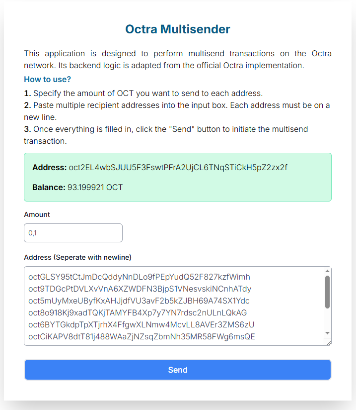

# Octra Multisend WebUI
This application is designed to perform multisend transactions on the Octra network. Its backend logic is adapted from the official Octra implementation.
> Check the official octra repo https://github.com/octra-labs

## 🧰 Tech Stack

- 🐍 **Flask** – REST API backend
- ⚙️ **Express.js** – Serve frontend HTML/CSS
- 🎨 **HTML5/CSS3** – Frontend UI
- 🟢 **Node.js** – Runtime for Express
- 📦 **npm/pip** – Package manager

## 🚀 Feature
Multisend to multiple addresses

## 📋 Prerequisites
- NodeJS v22
- npm
- Python 3

## ⚙️ Installation
1. Clone repository
<pre>
git clone https://github.com/hilmimz/octra-multisend-webui.git
cd octra-multisend-webui
</pre>
2. Install python dependencies
<pre>
pip install -r requirements.txt
</pre>
3. Setup your wallet
<pre>
cp wallet.json.example wallet.json
</pre>
4. Change the private key (B64) and address 
<pre>
{
  "priv": "private key here",
  "addr": "octxxxxxxxxxxxxxxxxxxxxxxxxxxxxxxxxxxxxxxxx",
  "rpc": "https://octra.network"
}
</pre>
5. Setup Express
<pre>
npm install
</pre>

## ✅ Run the app
<pre>
npm run start
</pre>
Then open http://127.0.0.1:5000 on your browser

## ⚠️ Disclaimer
Use it **at your own risk**. The authors are **not responsible** for any loss, damage, or unexpected behavior resulting from the use of this application.